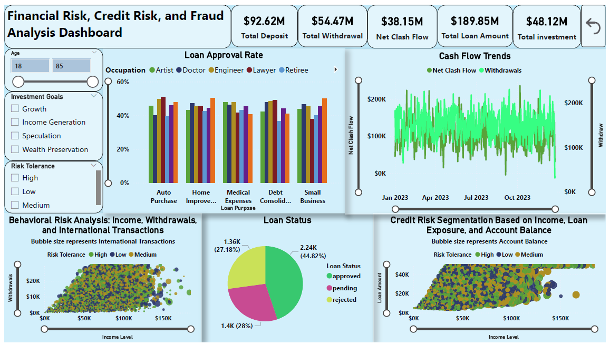
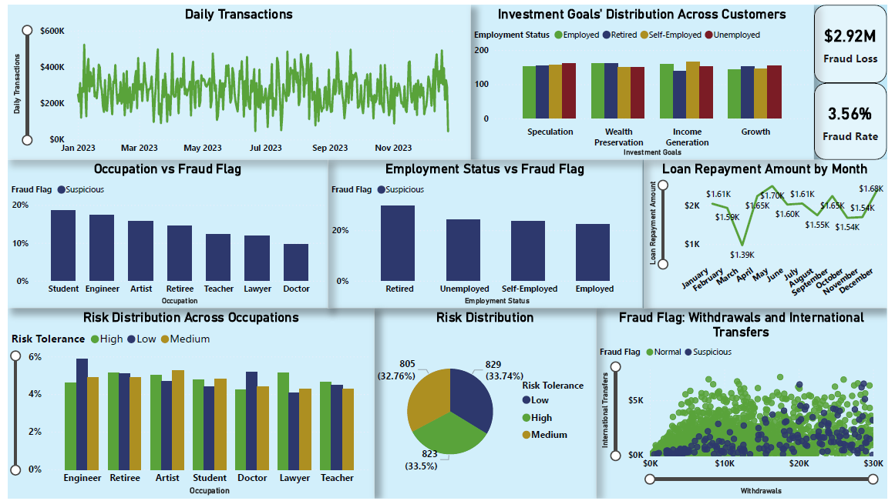

# 📊 Financial Risk, Credit Risk & Fraud Analysis Dashboard

## 🧾 Project Overview
This project analyzes customer financial behavior, credit risk, and fraud patterns using a dataset covering January 2023 to December 2023. The objective is to identify high-risk customers, detect fraudulent activities, and provide actionable insights to improve financial decision-making.

The project demonstrates how data can be used to enhance:
 -	Fraud detection systems 
 -	Credit risk segmentation 
 -	Loan approval strategies 
 -	Financial monitoring and stability
   
This project demonstrates an end-to-end data analytics workflow using Power BI, DAX, and PostgreSQL.

## 📁 Dataset & Source
-	Source: Finance Dataset for Credit Risk, Fraud Detection (https://www.kaggle.com/datasets/s3r1alsh0ck/finance-dataset-for-credit-risk-fraud-detection/data)
-	Time Period: January 2023 – December 2023 (Synthetic Dates) 
-	Purpose: Used for learning and building financial risk, fraud detection, and credit risk analysis dashboards.

## ❓ Business Questions
-	Which customer segments are most associated with fraud risk? 
-	How do occupation and employment status influence risk? 
-	What factors impact loan approval rates? 
-	How does cash flow behave over time? 
-	What is the overall fraud rate and financial loss? 
-	How can financial institutions improve risk-based decisions? 

## 💰 Key Performance Indicators (KPIs)
### 📊 Financial Overview
-	Total Deposits: $92.6M 
-	Total Withdrawals: $54.47M 
-	Net Cash Flow: $38.1M → ✅ Positive cash flow indicates strong liquidity 
-	Total Loan Amount: $189.85M 
-	Total Investments: $48.12M 

## 🚨 Fraud Metrics
-	Fraud Loss: $2.92M
→ Represents direct financial impact of suspicious transactions 
-	Fraud Rate: 3.56%
→ Indicates proportion of suspicious transactions in the dataset

👉 Insight: While fraud rate is relatively low, the financial impact is significant, making fraud detection critical.

## 📊 Business Insights & Interpretation
💳 Fraud Detection Insights
-	Fraud rate stands at 3.56%, indicating a moderate level of risk exposure 
-	Fraud loss of $2.92M highlights significant financial impact despite lower frequency 
-	Fraud is concentrated in specific behavioral patterns: 
  -	High withdrawals
  -	Large international transfers
  -	High-risk customers

👉 Business Insight: Fraud is not random and it is behavior-driven and can be predicted.

## 👔 Occupation vs Fraud Risk
-	Students contribute the highest suspicious share (~20%) 
-	Engineers show relatively high fraud contribution 
-	Doctors have the lowest fraud share (~9.55%) 
-	Lawyers (~11.80%) and Teachers (~12.36%) fall in moderate range
  
👉 Insight: Early-career or financially unstable groups show higher fraud concentration.

## 🏢 Employment Status vs Fraud Risk
-	Retired: 29.57% (highest fraud share) 
-	Unemployed: 24.26% 
-	Self-employed: 23.60% 
-	Employed: 22.47%
  
👉 Insight: Lack of stable income is strongly linked to higher fraud involvement.

## 📈 Loan Approval Analysis
-	Loan approval varies significantly across occupations and purposes 
Key observations:
  - Auto purchase: Lawyers → 58.58% approval
  - Home improvement: Teachers → 50.35% approval
  - Medical expenses: Engineers/Artists → ~47%
  - Small business: Teachers → 50% approval
 	
👉 Insight: Loan decisions are profile-driven, not uniform.

## 💸 Cash Flow Behavior
- Net cash flow: $38.1M (positive) 
- 	Deposits exceed withdrawals, indicating financial stability 
-	Fluctuations observed across months, especially mid-year
  
👉 Insight: System shows healthy liquidity with periodic volatility.

## ⚠️ Risk Distribution
-	Low Risk: 33.74% 
-	Medium Risk: 32.76% 
-	High Risk: 33.5%
  
👉 Insight: Risk is evenly distributed, enabling balanced decision-making.

## 📊 Loan Repayment Behavior
-	Lowest repayment: March (~$1.39K) 
-	Highest repayment: May (~$1.70K) 
-	Stable repayment trend across the year
  
👉 Insight: Customers demonstrate consistent repayment capability.

## 📊 Transaction Behavior
-	Daily transactions show significant fluctuations 
-	High spikes indicate large financial activities 
-	Low periods indicate reduced engagement
  
👉 Insight: Customer behavior is dynamic and requires monitoring systems

## 🎯 Key Business Takeaways
-	Fraud is behavior-driven, not random 
-	A 3.56% fraud rate leads to a high $2.92M loss, highlighting financial risk 
-	Occupation and employment status strongly influence risk exposure 
-	Loan approval depends on customer profile and purpose 
-	Financial system is stable but requires monitoring for anomalies 

## 💼 Business Impact
This dashboard enables financial institutions to:
-	Detect fraud patterns early → reduce financial loss 
- Identify high-risk customers → improve risk management 
- Optimize loan approvals → increase profitability 
-	Monitor financial health → ensure liquidity stability 

## 📌 Recommendations for Financial Companies
### 🔍 Fraud Prevention
-	Implement real-time fraud detection systems 
-	Monitor high-risk segments: 
 -	Students 
 -	Retired 
 -	Unemployed 

### 📊 Risk-Based Decision Making
-	Use risk tolerance and transaction behavior for loan approvals 
-	Apply stricter checks for high-risk profiles 

### 💳 Transaction Monitoring
Flag: 
 -	High withdrawals 
 -	Large international transfers 
-	Use automated alerts for abnormal activity 

### 📈 Customer Segmentation
-	Segment customers into risk categories 
-	Offer personalized financial products based on risk level 

### 💰 Financial Stability
-	Monitor cash flow trends regularly 
-	Identify unusual spikes or drops early 

## 🎯 Final Conclusion
This project demonstrates how financial data can be leveraged to:
-	Detect and reduce fraud 
-	Improve credit risk assessment 
-	Optimize financial decision-making 
-	Enhance customer segmentation
-	
👉 With a 3.56% fraud rate leading to $2.92M loss, the project highlights the importance of data-driven fraud detection and risk management systems in modern financial institutions.

## 🛠️ Tools & Technologies Used
-	Power BI → Dashboard & visualization 👉 [View Dashboard](./Financial Dashboard.pdf)
-	DAX → Measures and calculations 
-	PostgreSQL → Data querying 👉 [View Queries](./PostgreSQL_Queries.md)
- Kaggle Dataset → Data source 
